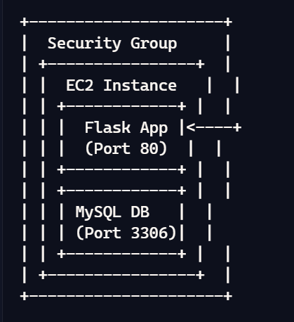

Have Terraform create the resources   `terraform apply` 
Have Terraform create and output json file to capture the IP address of ec2 Instance  `terraform output -json > terraform-output.json` 
Run Ansible Flask role which does the following: 
Create a mysql db   `sudo apt install mysql-server` 
Create table within the MySql DB  `sudo mysql -u root -e "CREATE DATABASE todo_db";` 
Create a user for the mysql db  `sudo mysql -u root -e "CREATE USER 'paige'@'localhost' IDENTIFIED BY 'password'";` 
Grand necessary privileges required for user to make edits to the entire database  `sudo myql -u root -e "GRANT ALL PRIVILEGES ON *.* TO 'paige'@'localhost' WITH GRANT OPTION";` 
Clone down the git repo  `git clone https://github.com/CyberInu/todolist-flask.git` 
Change directory into the todo folder  `cd todolist-flask` 
Create a virtual environment  `python3 -m venv menv` 
Start the virtual environment  `source ./menv/bin/activate` 
Install the requirements.txt  `pip3 install -r requirements.txt` 
Run gunicorn  `gunicorn -w --bind 0.0.0.0:8000 wsgi:app` 
Check to see if page loaded correctly confirm database works 

 Architecture Diagram 

